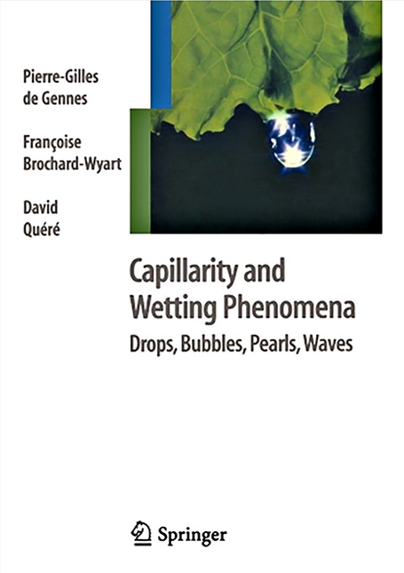

## Introductory Books

- **How the World Flows: Microfluidics from Raindrops to Covid Tests** A. Folch (Oxford University Press) [link](https://academic.oup.com/book/59761)

<table align="center">
  <tr>
    <td></td>
    <td></td>
  </tr>
</table>

## Books

- **Introduction à la microfluidique.** P. Tabeling (Belin) — [link](https://www.amazon.fr/Introduction-%C3%A0-microfluidique-P-Tabeling/dp/2701135001/ref=sr_1_1?s=books&ie=UTF8&qid=1520548930&sr=1-1&keywords=9782701135007&dpID=51YEDW60ZSL&preST=_SY291_BO1,204,203,200_QL40_&dpSrc=srch)
- **Introduction to Microfluidics.** P. Tabeling (Oxford Univesity Press)
- **Microfluidics for biotechnology.** J. Berthier and P. Silberzan — [link](https://www.amazon.fr/Microfluidics-Biotechnology-Microelectromechanical-Berthier-2005-10-31/dp/B01JXRO5BU/ref=sr_1_1?s=books&ie=UTF8&qid=1520548993&sr=1-1&keywords=silberzan&dpID=41j1OG%252Bn4VL&preST=_SY291_BO1,204,203,200_QL40_&dpSrc=srch)
- **Introduction to micro fabrication.** S. Franssila (Wiley) — [link](https://www.amazon.fr/Introduction-Microfabrication-Sami-Franssila-2010-10-25/dp/B01FKROG0M/ref=sr_1_2?s=books&ie=UTF8&qid=1520549072&sr=1-2&keywords=microfabrication+franssila&dpID=51FtSfIRR3L&preST=_SY291_BO1,204,203,200_QL40_&dpSrc=srch)
- **Gouttes, bulles, perles et ondes.** P.G. de Gennes, F. Brochard-Wyart, D. Quéré (Belin) — [link](https://www.belin-editeur.com/gouttes-bulles-perles-et-ondes)
- **Capillarity and Wetting Phenomena: Drops, Bubbles, Pearls, Waves.** P.G. de Gennes, F. Brochard-Wyart, D. Quéré (Belin) — [link](https://www.belin-editeur.com/gouttes-bulles-perles-et-ondes)

## Journal Articles

- **There's plenty of room at the bottom**, R. Feynman, 1959 — [link](http://www.zyvex.com/nanotech/feynman.html)
- **Soft lithography**, Y. Xia and G. Whitesides, *Annu. Rev. Mater. Sci*, 1998 — [link](https://www.google.fr/url?sa=t&rct=j&q=&esrc=s&source=web&cd=2&ved=0ahUKEwj_ts6y593ZAhWBsRQKHWx1D_AQFgg7MAE&url=https%3A%2F%2Fgmwgroup.harvard.edu%2Fpubs%2Fpdf%2F604.pdf&usg=AOvVaw10x7dG7r4OrlWpsheZEmZ_)
- **Miniaturized Total Chemical Analysis Systems: a Novel Concept for Chemical Sensing**, A. Manz et al., *Sens. Actuators B*, 1990 — [link](https://microfluidicsmaster.files.wordpress.com/2018/03/microtas-sensors-and-actuators-widmer.pdf)
- **Nanofluidics, from bulk to interfaces**, *Chem. Soc. Rev.*, 2009 — [link](http://www.phys.ens.fr/~lbocquet/ChemSocRev-Bocquet-2010.pdf)

## Other resources

- **MEMScyclopedia**: <https://memscyclopedia.org>
- **Conférence expérimentale à l'ESPGG**: [La microfluidique, une plomberie à l’échelle d’une puce](https://www.youtube.com/watch?v=INjHPUbAlSk)
MD